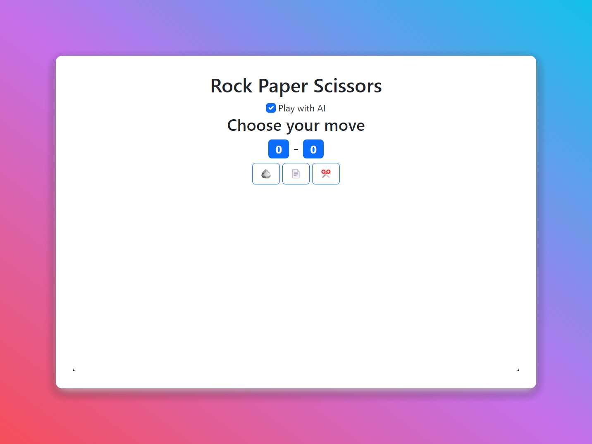

# 🪨📄✂️ Rock Paper Scissors Website 



[](https://exelvi.github.io/rock-paper-scissors-website/)
[](https://github.com/EXELVI/rock-paper-scissors-website/issues)
[](https://github.com/EXELVI/rock-paper-scissors-website/network)
[](https://getbootstrap.com/)

## 📜 Overview

This project is a simple **Rock Paper Scissors** game built with HTML, CSS, and JavaScript. The game allows players to compete against an AI or against another player. The UI is styled using Bootstrap.

## 🌟 Features

- Play against AI or with a friend in two-player mode.
- Responsive and mobile-friendly design.
- Real-time score tracking.
- Easy-to-understand interface with emojis representing the moves.
- Built using Bootstrap for a modern look.

## 🛠️ Installation

To run this project locally, follow these steps:

1. Clone the repository:
    ```bash
    git clone https://github.com/EXELVI/rock-paper-scissors-website.git
    ```
2. Navigate to the project directory:
    ```bash
    cd rock-paper-scissors-website
    ```
3. Open `index.html` in your favorite browser:

## 🚀 Usage

- Open the website and select whether to play against the AI or another player.
- Choose your move (Rock, Paper, or Scissors) by clicking the corresponding button.
- The game will immediately display the result and update the score.

## 🌐 Demo

You can play the game [here](https://exelvi.github.io/rock-paper-scissors-website/).


## 🤝 Contributing

Contributions are welcome! If you have any suggestions or improvements, feel free to open an issue or submit a pull request.

